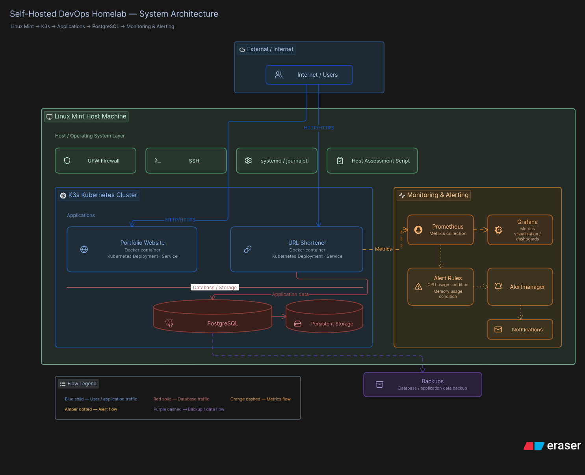
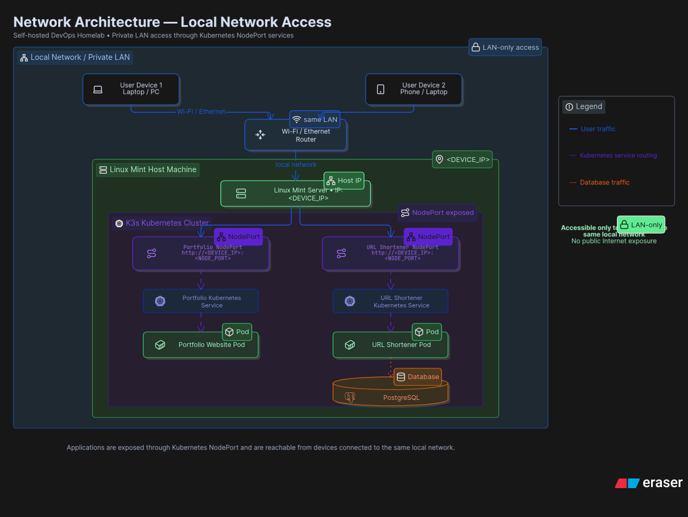
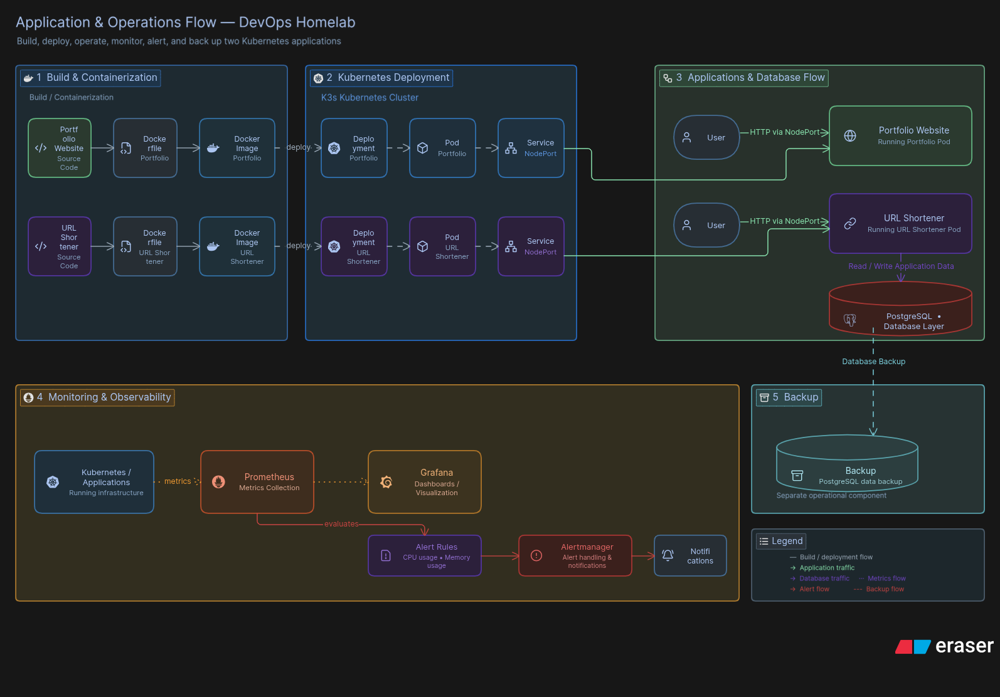

# Self-Hosted DevOps Homelab

A self-hosted DevOps environment built on a Linux Mint host using K3s Kubernetes.

The project runs two real-world applications — a personal portfolio website and an open-source URL shortener — using Docker and Kubernetes.

It also includes PostgreSQL for application data, Prometheus and Grafana for monitoring, Alertmanager for alerts, and host-level tooling for system assessment and administration.

## Goals

- Deploy and manage real-world applications using Kubernetes.
- Self-host my personal portfolio website.
- Deploy an open-source URL shortener.
- Practice Linux and Kubernetes in a real environment.
- Use PostgreSQL for application data.
- Implement monitoring with Prometheus and Grafana.
- Configure Alertmanager for critical resource alerts.
- Build a reproducible and maintainable homelab environment.
- Learn by deploying, breaking, troubleshooting, and rebuilding the system.

## Architecture

The homelab runs on a Linux Mint host machine with K3s providing the Kubernetes environment.

The Kubernetes cluster runs the Portfolio Website and URL Shortener. PostgreSQL provides database services, while Prometheus and Grafana provide monitoring and Alertmanager handles resource-based alerts.



## Network Architecture

The applications are exposed using Kubernetes NodePort services.

The Linux Mint host is connected to a private local network. Devices connected to the same router can access the applications through the host machine's IP address and the configured NodePort.



## Application & Operations Flow

Both applications are containerized using Docker and deployed to the K3s Kubernetes cluster through Kubernetes Deployments and Services.

The URL Shortener uses PostgreSQL for persistent application data. Prometheus collects system and application metrics, Grafana provides visualization, and Alertmanager handles configured alerts.



## Technology Stack

| Category | Technology |
|---|---|
| Operating System | Linux Mint |
| Containerization | Docker |
| Orchestration | K3s / Kubernetes |
| Database | PostgreSQL |
| Monitoring | Prometheus |
| Visualization | Grafana |
| Alerting | Alertmanager |
| Version Control | Git / GitHub |
| Scripting | Bash |

## Applications

### Portfolio Website

My personal portfolio website is containerized using Docker and deployed on the K3s Kubernetes cluster.

- Dockerfile for containerization
- Kubernetes Deployment
- Kubernetes NodePort Service
- Accessible within the local network

### URL Shortener

An open-source URL shortener is deployed as a separate Kubernetes workload.

- Dockerfile for containerization
- Kubernetes Deployment
- Kubernetes NodePort Service
- PostgreSQL for application data
- Accessible within the local network

## Monitoring & Alerting

Prometheus is used to collect system and application metrics, while Grafana provides dashboards for visualization.

Alert rules are configured to detect resource conditions such as CPU and memory usage. Alertmanager handles the configured alerts and notifications.

### Monitoring Stack

- Prometheus — Metrics collection
- Grafana — Metrics visualization
- Alertmanager — Alert handling and notifications
- `alert-rules.yml` — Alert rule configuration

## Database & Backups

PostgreSQL is used by the URL Shortener to store application data.

The database is hosted as part of the homelab infrastructure, with backups configured to protect application data.

- PostgreSQL — Application database
- Persistent data storage
- Database backups

## Linux / Host Configuration

The homelab runs on a Linux Mint host machine.

Host-level configuration and administration includes:

- SSH for remote administration
- UFW for firewall configuration
- systemd / journalctl for service management and logs
- `host-assessment.sh` for assessing the server
- Host-level documentation and configuration

## Project Requirements

- Linux Mint host machine
- Docker
- K3s / Kubernetes
- PostgreSQL
- Prometheus
- Grafana
- Alertmanager
- Git / GitHub

## Repository Structure

```text
devops-homelab/
├── apps/
├── backups/
├── config/
├── database/
├── docs/
├── k8s/
├── monitoring/
├── scripts/
└── README.md
```

## Documentation

- [Linux & Host Configuration](docs/linux.md)
- [SSH Configuration](docs/ssh.md)
- [UFW Firewall](docs/ufw.md)
- [systemd & journalctl](docs/systemd.md)
- [PostgreSQL](docs/postgresql.md)
- [Kubernetes](docs/kubernetes.md)
- [Monitoring](docs/monitoring.md)
- [URL Shortener](docs/url-shortener.md)
